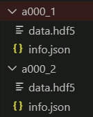
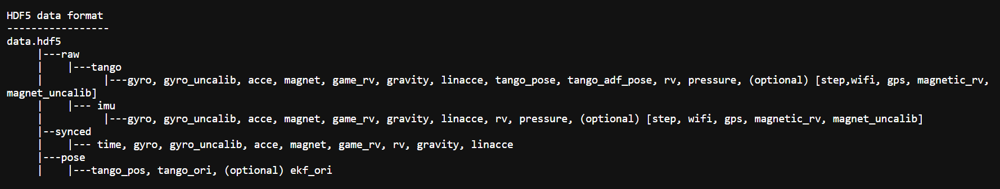
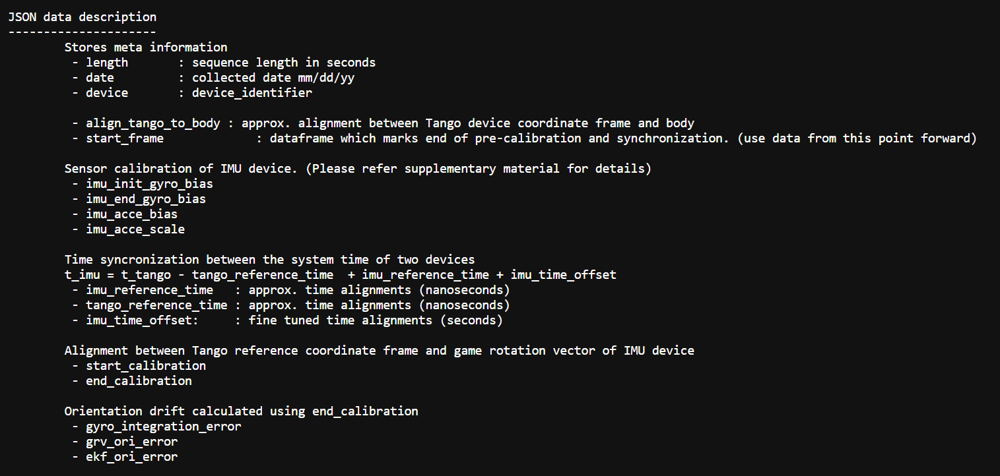
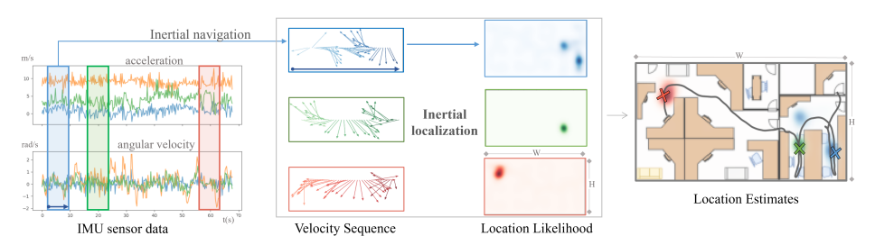

# Repository for pure IMU-based localization via NILoc + RoNIN study

## Internship research project for ICHIRO ITS Robotics Team.

See my presentation [**here**](https://www.canva.com/design/DAF-cFqGwCI/SdqnlEVeQPoiCFPIoyPGFw/view?utm_content=DAF-cFqGwCI&utm_campaign=designshare&utm_medium=link&utm_source=editor), supplementary materials can be accessed [**here**](./supplementary.txt).

To start, you can run [main.py](./main.py). This will set up the raw IMU dataset into something usable by the Niloc evaluation script.

Format your data into something like this, contained in a parent folder, that parent folder is then what you pass into main.py.  

The HDF5 should contain these  

with the only required ones being everything that [game_rv](https://developer.android.com/develop/sensors-and-location/sensors/sensors_position#sensors-pos-gamerot) provides.

`info.json` would contain the calibration parameters:  

You can then follow the instructions in the [colab notebook](./NILOC.ipynb) to configure Niloc's evaluation script.

## **What is this**

Usually localization is done via signal processing and IMU data. However, sometimes, in certain situations, signal processing may not be accurate to pinpoint the location of your robot.

Not to mention, sometimes there are certain requirements as to what type of IMU data you can use in a competition, e.g. for example, magnetometer might not be allowed.

Anecdotal evidence says that, using purely the game rotational vector (game_rv: i.e., accelerometer + gyrometer, w/o magnetometer) gives [poor,](https://robotics.stackexchange.com/questions/8857/imu-position-without-gps-or-camera) if [not basically unusable,](https://robotics.stackexchange.com/questions/8941/localization-with-only-imu) [localization performance.](https://robotics.stackexchange.com/questions/6367/how-to-combine-an-accelerometer-and-a-gyroscope-to-find-robot-location-and-orien)

This is due to a multitude of things, namely cumulative error, sensor bias, etc.

And so, Niloc proposes their solution, which-- actually let's backtrack. While it _is_ true that using purely game_rv data would *not* suffice; one can do an inertial navigation (which is a 2D velocity vector that shows the direction which you're going towards) data estimation from game*rv, which \_then* can be used to do inertial localization.

This is where RoNIN comes in. If you're one of my mentors then you might be thinking: "wait, RoNIN? I thought we're just learning about Niloc?" Well, as it turns out, no. Unless we have inertial navigation data to input into Niloc, we cannot compute the localization purely straight from the game_rv IMU.

## **RoNIN**

RoNIN estimates the inertial navigation measurement given game\_rv data. Prior to RoNIN, there *were* methods that can estimate the inertial navigation data, however they require precisely tuned instruments to accurately measure the inertial navigation, _or,_ a very controlled environment.

Given a `200 × 6` tensor of 200 frame game_rv measurements, RoNIN produces a 2D velocity vector at the last frame.

## **Niloc**

What Niloc does, is it takes in these velocity sequences, and produces a location "likelihood", which is basically an estimate as to where the robot could be.

You can see that likelihood result from in my supplementary materials.

### **Closing Notes** 🙇

I sincerely thank all of my mentors during my internship period for all the hard work and opportunity that I've been given.

Regardless of what comes of the internship announcement, I am very glad and thankful of all that I've learned and picked up on during my internship, thanku mas & mbak.

